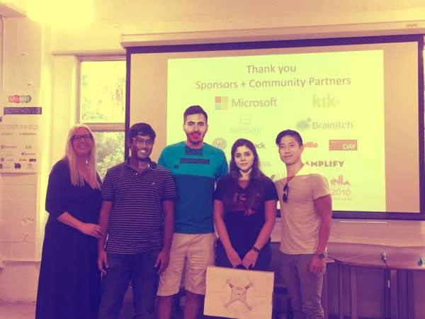

# SmartHome Bot - 1st Prize Winner of Microsoft Botathan 1.0

Link to Competition Page: https://devpost.com/software/smart-homebot
# Inspiration
Urban areas are increasing worldwide and more than 70% of the world population will be located in urban centers by 2050. This growth leads to an increase in number, and density of buildings. It is also interesting to note that people spend about 87% of their time indoors. In 2014, buildings consume more than 70% of the total electricity consumption in United states. This significant share demonstrates the importance of using automation strategies that result in more energy efficient operation of the service systems in buildings (e.g., lighting systems, appliances, and HVAC).

# What it does
It controls and monitors devices in a smart home via Skype and Kik. Intelligent bot can interact with user users wherever they are. In contrast to existing automation technologies that offer fixed template to control home devices or require the user access to control devices, our project is capable of naturally understanding the users' needs wherever they are.

# How we built it
First, we made the base framework using Microsoft Bot. Next, we started with LUIS, as it is critical to the whole idea of using Natural Language. After building the language module independently, we integrated the bot with the LUIS module. Then we used the Skype channel, so the interaction with the bot can be done over Skype instead of the console window.

# What's next for Smart HomeBot
We are planning to extend are project to include more control capabilities, such as HVAC control, window blinds control, and door control. Also the Smart HomeBot will provide the user with information about the electricity consumption of the devices, indoor temperature and occupancy status. Finally, the Smart HomeBot will offer the user with recommendations for saving more energy.

